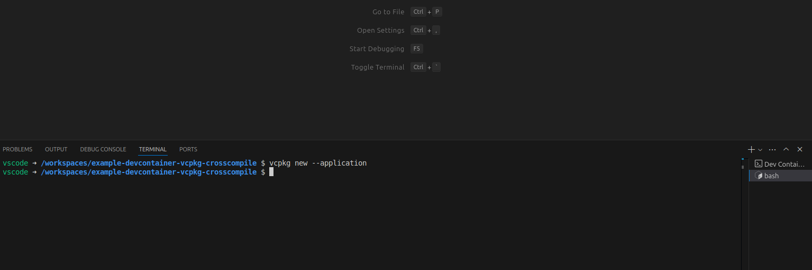
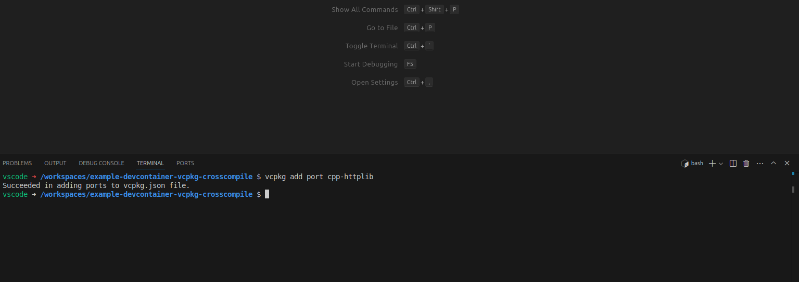
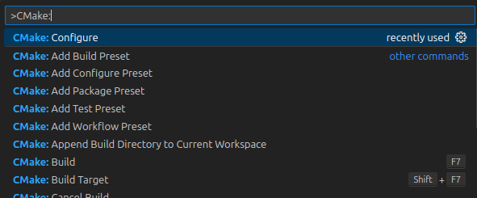

# Summary

This repository contains a functional example of an application (a trivial HTTP server) implemented in C++, built in a Dev Container, using external dependencies from vcpkg, and cross-compiled for multiple target platforms.

# Purpose

The application being built here is simple, but the development environment isn't.  Getting the right tools installed and (especially) the right CMake configuration settings took quite a bit of trial and effort!  I don't want to forget those details and need to re-discover them next time.  :)

This repository is primarily for my own reference, but other developers interested in cross-compiling C and C++ might also find these solutions helpful ... or at least amusing.

# Key concepts

## Dev Container


A [Dev Container](https://containers.dev/) sets up the project's cross-toolchains, and other dev tool dependencies like vcpkg.

The dependency-management and cross-compilation aspects of this project require significant environment setup, and any mistake in that setup process could result in build failures -- or even worse, an apparently-successful build whose result fails later at runtime.  It's important that whether the project is loaded on a new machine, on a new team member's system, or on an automated build agent, that development environment can be consistently re-created.

Defining the development environment's setup steps in a Dev Container ensures that all required tools and configuration settings are prepared by the container, regardless of the developer's (or build agent's) host system.  Many IDEs support building, running, and debugging software with Dev Containers; and GitHub Actions can use a Dev Container to build a project in workflows like Pull Requests and continuous integration.

## vcpkg and CMake

 

[vcpkg](https://vcpkg.io/) and [CMake](https://cmake.org/) are used to download and configure the project's external code dependencies.

External library re-use is important when developing applications, to accelerate common patterns and to correctly integrate external services.  But fans of modern dev package managers, like C#'s NuGet and Node.js's NPM, may be surprised that there's no *de facto* equivalent for C and C++; there are multiple community-supported options, each with their own strengths and weaknesses.

This example leverages the combination of vcpkg, which retrieves software packages from a "ports" repository, and CMake, which describes how those packages are built from source.  This source-based dependency approach is helpful when cross-compiling.  And this package management option is expected to be well-supported into the future, due to these tools' industry sponsorship and widespread adoption.

## Cross-compiling

 

Cross-compiling - using a Host system to produce software for a different Target system - isn't very commonly documented (or well-supported), despite being vital to common use-cases like mobile phone apps, internet-of-things appliances, and videogame consoles.  In an ideal world, the developer's or build agent's Host system would be totally irrelevant; unfortunately, each combination of Host and Target has its own quirks to figure out.

But there *are* some common ways to approach these problems, which this project demonstrates using a few pre-built toolchains (installed to its Dev Container) and modular build configuration (implemented through CMake, and applied to dependencies through vcpkg).  Here, a [MinGW-w64](https://www.mingw-w64.org/) toolchain is used to produce the application for a Windows target, and a [musl-cross](https://musl.cc/) toolchain is used to produce the application for an ARM (AArch64) target with [musl libc](https://musl.libc.org/) (tested on an [OpenWrt](https://openwrt.org/) system).

# How it's made

These steps walk through how to create this example project again, from scratch.

(Not the same thing as "how the author originally created this project"; that list of steps was much longer, with many failed attempts, rewrites, naps, and drinks.)

## Requirements

While a Dev Container takes cares of the project's development environment, *running the Dev Container* requires some setup on your host system first.

* A container runtime; [Docker](https://docs.docker.com/engine/install/) was used to create this project.
  * On a Linux host, for Dev Container tooling (such as your chosen IDE) to interact with Docker successfully, you may need to grant your non-root user account the permissions of the "docker" group: `sudo usermod -aG docker $USER`
  * On a Windows host, you may want to use the Docker Desktop application *or* docker installed through a [Windows Subsystem for Linux](https://learn.microsoft.com/en-us/windows/wsl/install) instance.

* A Dev Containers client; [Visual Studio Code](https://code.visualstudio.com/) was used to create this project.
  * Note that the example project includes VS Code extension suggestions, to enhance development workflows.  Similar enhancements for other IDEs may also be possible.
  * An [official devcontainers CLI](https://github.com/devcontainers/cli) is available, but - pretty ironically - has quite a few manual setup steps of its own.  So, this guide doesn't yet recommend CLI-based Dev Container management.

## The Dev Container

In this step we define the Dev Container, and how to create and use it in your host environment.

Create a `.devcontainers` directory, and a file in it named `devcontainer.json`.  This is a [special filepath](https://code.visualstudio.com/docs/devcontainers/create-dev-container#_create-a-devcontainerjson-file) commonly recognized by IDEs as the definition for a default Dev Container.

`.devcontainers/devcontainer.json`
```json
{
	"name": "vcpkg-crosscompile",
	"build": {
		"dockerfile": "./Dockerfile"
	},
	"features": {
		"ghcr.io/devcontainers/features/powershell:1": {}
	}
}
```

This Dev Container definition combines a `"build"` Dockerfile's container image (described in the next step) and `"features"` which are installed on top of that image.  The powershell feature will install [PowerShell](https://github.com/PowerShell/PowerShell) *a.k.a PowerShell Core, a.k.a `pwsh`*, which is needed by some vcpkg ports to configure Windows target builds.

*Hypothetical improvements on this Dev Container might re-implement the Dockerfile's steps as `"features"`, or might replace all of the Dockerfile and `"features"` steps with a pre-built container image; in practice, every project should strike its own balance of re-usable vs. bespoke definitions.*

Now create a file named `Dockerfile` in that same directory.  This fills out the `"dockerfile"` referenced by that `devcontainer.json` file.

`.devcontainers/Dockerfile`
```dockerfile
FROM mcr.microsoft.com/devcontainers/cpp:dev-ubuntu-24.04

ENV DEBIAN_FRONTEND=noninteractive

RUN apt update && \
	apt install -y g++-mingw-w64-x86-64

ADD https://musl.cc/aarch64-linux-musl-cross.tgz /musl.cc/
RUN tar xzf /musl.cc/aarch64-linux-musl-cross.tgz -C /
ENV AARCH64_LINUX_MUSL_CROSS_PREFIX=/aarch64-linux-musl-cross
```

This Docker image definition starts with a [C++ Dev Container image from Microsoft](https://github.com/devcontainers/images/tree/main/src/cpp) using Ubuntu Linux "Focal Fossa" 24.04, plus vcpkg and CMake and related dependencies; then installs the `g++-mingw-w64-x86-64` [apt package](https://packages.ubuntu.com/focal/g++-mingw-w64-x86-64) for cross-compilation tools targeting AMD64 (x86_64) Windows; then downloads and unarchives cross-compilation tools targeting 64-bit ARM (AArch64) Linux with musl's libc.

*Dockerfiles, Ubuntu and apt, gcc and g++, MinGW-w64, glibc and musl -- are all interesting topics outside the scope of this README.  Would you like to know more?  Search the interweb!*

(Assuming VS Code) Create a `.vscode` directory, and a file in it named `extensions.json`.  This is a [special filepath](https://code.visualstudio.com/docs/editor/extension-marketplace#_workspace-recommended-extensions) to suggest that VS Code install [the Dev Containers extension](https://marketplace.visualstudio.com/items?itemName=ms-vscode-remote.remote-containers) if it isn't installed already.

`.vscode/extensions.json`
```json
{
	"recommendations": [
		"ms-vscode-remote.remote-containers"
	]
}
```

Now, opening this folder in VS Code will cause it to ask to install the Dev Containers extension, if you don't have it already:


And after the extension is installed, VS Code will suggest re-opening the folder using that Dev Container as its development environment:


This completes Dev Container setup.  Subsequent steps will use the container's environment to execute development workflows.

## Initializing vcpkg

Within the Dev Container, set up vcpkg for the application, so the build system can retrieve dependencies from vcpkg's registry.

(Assuming VS Code) After an IDE has created the Dev Container, the IDE may require some UI manipulation to access the container's terminal:


Now, from a command shell inside the Dev Container, run `vcpkg new --application` to initialize vcpkg.  This fetches some scripts and data from vcpkg's most-recent [git version](https://github.com/microsoft/vcpkg).



This will generate two new files in the current directory: a default `vcpkg-configuration.json` which records that vcpkg git version and port registry info; and an empty `vcpkg.json` describing project settings like dependencies (which haven't been added yet).

`vcpkg-configuration.json`
```json
{
  "default-registry": {
    "kind": "git",
    "baseline": "...",
    "repository": "https://github.com/microsoft/vcpkg"
  },
  "registries": [
    {
      "kind": "artifact",
      "location": "https://github.com/microsoft/vcpkg-ce-catalog/archive/refs/heads/main.zip",
      "name": "microsoft"
    }
  ]
}
```

`vcpkg.json`
```json
{}
```

*Hypothetically, custom vcpkg registries can be added for access to different packages/ports, such as private libraries created by a team maintaining their own registry.*

Now, add a port!  The example application will use the [cpp-httplib package](https://vcpkg.io/en/package/cpp-httplib) to implement an HTTP server.  Add that package to the project's vcpkg dependencies with `vcpkg add port cpp-httplib`.



This records the new dependency in `vcpkg.json`, instructing vcpkg's build scripts to download its source and use its compilation settings later on.

`vcpkg.json`
```json
{
  "dependencies": [
    "cpp-httplib"
  ]
}
```

## Defining builds in CMake

The application's build definitions will be written in CMake files, specifically in [a CMakeLists file](https://cmake.org/cmake/help/book/mastering-cmake/chapter/Getting%20Started.html#cmakelists-files) describing the sources used by the project, and in [CMake configuration "presets"](https://cmake.org/cmake/help/latest/manual/cmake-presets.7.html) to implement build settings needed for cross-compilation.

*But first*, a small detour: create a file named `main.cpp` with a placeholder `main()` entrypoint so that the project will have something to compile.

`main.cpp`
```cpp
int main(void)
{
    return 0;
}
```

And a file named `CMakeLists.txt` with some basic compile and link settings (which this guide will revise in a later step).  These settings will also install the httplib dependency, though it isn't being used just yet.

`CMakeLists.txt`
```cmake
cmake_minimum_required(VERSION 3.25)

project(HttpDemo)
add_executable(HttpDemo)

target_sources(HttpDemo PRIVATE main.cpp)

find_package(httplib CONFIG REQUIRED)

install(TARGETS HttpDemo RUNTIME DESTINATION bin)

target_link_libraries(HttpDemo PRIVATE -static-libstdc++ -static-libgcc)
```

Here's where the build definitions get interesting: create a file named `CMakePresets.json`, where the project will define the project's [configuration presets](https://cmake.org/cmake/help/latest/manual/cmake-presets.7.html#configure-preset).

`CMakePresets.json`
```json
{
	"version": 6,
	"cmakeMinimumRequired": {
		"major": 3,
		"minor": 25,
		"patch": 0
	},
	"configurePresets": [
		{
			"name": "amd64-linux",
			"generator": "Ninja",
			"binaryDir": "${sourceDir}/build/${presetName}",
			"installDir": "${sourceDir}/dist/${presetName}",
			"cacheVariables": {
				"CMAKE_BUILD_TYPE": "Debug",
				"CMAKE_TOOLCHAIN_FILE": "$env{VCPKG_ROOT}/scripts/buildsystems/vcpkg.cmake",

				"VCPKG_TARGET_TRIPLET": "x64-linux",
				"VCPKG_CHAINLOAD_TOOLCHAIN_FILE": "$env{VCPKG_ROOT}/scripts/toolchains/linux.cmake"
			}
		},
		{
			"name": "amd64-mingw",
			"generator": "Ninja",
			"binaryDir": "${sourceDir}/build/${presetName}",
			"installDir": "${sourceDir}/dist/${presetName}",
			"cacheVariables": {
				"CMAKE_BUILD_TYPE": "Debug",
				"CMAKE_TOOLCHAIN_FILE": "$env{VCPKG_ROOT}/scripts/buildsystems/vcpkg.cmake",
				"VCPKG_OVERLAY_TRIPLETS": "${sourceDir}/custom-triplets",

				"VCPKG_TARGET_TRIPLET": "amd64-mingw",
				"VCPKG_CHAINLOAD_TOOLCHAIN_FILE": "${sourceDir}/custom-triplets/amd64-mingw-toolchain.cmake"
			}
		},
		{
			"name": "arm64-linux-musl",
			"generator": "Ninja",
			"binaryDir": "${sourceDir}/build/${presetName}",
			"installDir": "${sourceDir}/dist/${presetName}",
			"cacheVariables": {
				"CMAKE_BUILD_TYPE": "Debug",
				"CMAKE_TOOLCHAIN_FILE": "$env{VCPKG_ROOT}/scripts/buildsystems/vcpkg.cmake",
				"VCPKG_OVERLAY_TRIPLETS": "${sourceDir}/custom-triplets",

				"VCPKG_TARGET_TRIPLET": "arm64-linux-musl",
				"VCPKG_CHAINLOAD_TOOLCHAIN_FILE": "${sourceDir}/custom-triplets/arm64-linux-musl-toolchain.cmake"
			}
		}
	]
}
```

CMake will use these "preset" settings groups to configure each build type for the project.  Literally, CMake's configuration step will *generate* build files (including [Ninja](https://ninja-build.org/) build scripts), to be invoked by following build and install steps.

Those build files include vcpkg logic through each preset's `CMAKE_TOOLCHAIN_FILE` (the `vcpkg.cmake` file in vcpkg's installation root).  This [link between CMake and vcpkg](https://learn.microsoft.com/en-us/vcpkg/users/buildsystems/cmake-integration) is how the dependency-management system really works: functions like `find_package()` are implemented in vcpkg's CMake files, and those functions invoke `vcpkg` itself to find and download packages.

Critically in this project, vcpkg [defines a triplet concept](https://learn.microsoft.com/en-us/vcpkg/concepts/triplets) to collect the host- and target-specific settings needed to cross-compile.  Although the triplet alone doesn't fully define *how code is compiled* -- more about this in a moment.

Three configuration presets are defined in this example:

* "amd64-linux" prepares to build for an AMD64 Linux target, just like the Dev Container itself.  It uses vcpkg's built-in settings and defaults to select a compiler toolchain targeting the current host system.
* "amd64-mingw" prepares to build for an AMD64 Windows target.  This build will require the cross-compiling tools installed by the `g++-mingw-w64-x86-64` apt package in the Dev Container.
* "arm64-linux-musl" prepares to build for an ARM64 Linux target with the musl libc at runtime (as opposed to GNU's glibc).  This build will require the cross-compiling tools downloaded from [musl.cc](https://musl.cc/) in the Dev Container.

Notice that the amd64-mingw and arm64-linux-musl configurations define [VCPKG_OVERLAY_TRIPLETS](https://learn.microsoft.com/en-us/vcpkg/users/examples/overlay-triplets-linux-dynamic) and use custom triplet and toolchain files, instead of vcpkg's built-in files.  When vcpkg is given an Overlay Triplets path, and when the Target Triplet matches a file in that path, vcpkg and CMake will apply build settings in that file.

This example project must provide those custom triplet and toolchain files, too.  Create a `custom-triplets` directory, and a file in it named `amd64-mingw.cmake`.

`custom-triplets/amd64-mingw.cmake`
```cmake
set(VCPKG_TARGET_ARCHITECTURE x64)
set(VCPKG_CRT_LINKAGE dynamic)
set(VCPKG_LIBRARY_LINKAGE dynamic)
set(VCPKG_ENV_PASSTHROUGH PATH)

set(VCPKG_CMAKE_SYSTEM_NAME MinGW)
set(VCPKG_POLICY_DLLS_WITHOUT_LIBS enabled)

set(VCPKG_CHAINLOAD_TOOLCHAIN_FILE "${CMAKE_CURRENT_LIST_DIR}/amd64-mingw-toolchain.cmake")
```

This triplet file is mostly copied from a [community-provided "x64-mingw-dynamic" triplet](https://github.com/microsoft/vcpkg/blob/master/triplets/community/x64-mingw-dynamic.cmake), but with the addition of a [VCPKG_CHAINLOAD_TOOLCHAIN_FILE](https://learn.microsoft.com/en-us/vcpkg/users/triplets#vcpkg_chainload_toolchain_file) which enforces compiler and linker settings.  Without this toolchain file, CMake will use compiler and linker settings from its own defaults, which won't meet this project's cross-compilation needs.

Create this toolchain file in this same directory, named `amd64-mingw-toolchain.cmake`.

`custom-triplets/amd64-mingw-toolchain.cmake`
```cmake
if(NOT _AMD64_MINGW_TOOLCHAIN)
    set(_AMD64_MINGW_TOOLCHAIN 1)

    include("$ENV{VCPKG_ROOT}/scripts/toolchains/mingw.cmake")

    find_program(CMAKE_C_COMPILER "x86_64-w64-mingw32-gcc-posix")
    message(STATUS "Overriding CMAKE_C_COMPILER=${CMAKE_C_COMPILER}")
    find_program(CMAKE_CXX_COMPILER "x86_64-w64-mingw32-g++-posix")
    message(STATUS "Overriding CMAKE_CXX_COMPILER=${CMAKE_CXX_COMPILER}")

    set(CMAKE_BUILD_WITH_INSTALL_RPATH true)
    message(STATUS "Overriding CMAKE_BUILD_WITH_INSTALL_RPATH=${CMAKE_BUILD_WITH_INSTALL_RPATH}")
endif()
```

This toolchain file does largely re-use vcpkg's [mingw toolchain](https://github.com/microsoft/vcpkg/blob/master/scripts/toolchains/mingw.cmake), but forces C and C++ compilation to use the `-posix` variants of MinGW-w64's tools -- which have fuller compatibility with code written to use POSIX threading functions (pthreads).  It also forces [CMAKE_BUILD_WITH_INSTALL_RPATH](https://cmake.org/cmake/help/latest/variable/CMAKE_BUILD_WITH_INSTALL_RPATH.html) on, which conforms to Windows norms about the runtime dependency path (rpath) *i.e.* will build with the assumption that an executable and its dependency DLLs are installed to the same directory.

Now it's time to prepare custom triplet and toolchain files for the arm64-linux-musl configuration.  Create another file in the `custom-triplets` directory named `arm64-linux-musl.cmake`.

`custom-triplets/arm64-linux-musl.cmake`
```cmake
set(VCPKG_TARGET_ARCHITECTURE arm64)
set(VCPKG_CRT_LINKAGE dynamic)
set(VCPKG_LIBRARY_LINKAGE static)

set(VCPKG_CMAKE_SYSTEM_NAME Linux)

set(VCPKG_CHAINLOAD_TOOLCHAIN_FILE "${CMAKE_CURRENT_LIST_DIR}/arm64-linux-musl-toolchain.cmake")
```

Like the other custom triplet file, this is mostly copied from a [community-provided "arm64-linux" triplet](https://github.com/microsoft/vcpkg/blob/master/triplets/community/arm64-linux.cmake), adding a toolchain reference to set appropriate compiler and linker settings.

Finally, create that toolchain file in this same directory, `arm64-linux-musl-toolchain.cmake`.

`custom-triplets/arm64-linux-musl-toolchain.cmake`
```cmake
if(NOT _ARM64_LINUX_MUSL_TOOLCHAIN)
    set(_ARM64_LINUX_MUSL_TOOLCHAIN 1)

    include("$ENV{VCPKG_ROOT}/scripts/toolchains/linux.cmake")

    if(DEFINED ENV{AARCH64_LINUX_MUSL_CROSS_PREFIX})
        set(CMAKE_C_COMPILER "$ENV{AARCH64_LINUX_MUSL_CROSS_PREFIX}/bin/aarch64-linux-musl-gcc")
        message(STATUS "Overriding CMAKE_C_COMPILER=${CMAKE_C_COMPILER}")
        set(CMAKE_CXX_COMPILER "$ENV{AARCH64_LINUX_MUSL_CROSS_PREFIX}/bin/aarch64-linux-musl-g++")
        message(STATUS "Overriding CMAKE_CXX_COMPILER=${CMAKE_CXX_COMPILER}")
    else()
        message(FATAL_ERROR "Missing required ENV definition AARCH64_LINUX_MUSL_CROSS_PREFIX")
    endif()
endif()
```

*(Recall that an `AARCH64_LINUX_MUSL_CROSS_PREFIX` environment variable was set in the Dev Container's Dockerfile; this is where it's finally used!)*

This toolchain file re-uses vcpkg's [linux toolchain](https://github.com/microsoft/vcpkg/blob/master/scripts/toolchains/linux.cmake), then overwrites the default C and C++ compilers with the musl-targeting tools installed in the Dev Container.

*Phew!*  Now that the CMake and vcpkg and cross-compilation configurations are all in place, the project can create builds for each of its three target configurations.  If you want to test that out now (before finishing the example application's code) skip ahead to the command-line and VS Code build instructions later in this guide.

If you're using VS Code and the [CMake extension](https://marketplace.visualstudio.com/items?itemName=twxs.cmake) and [CMake Tools extension](https://marketplace.visualstudio.com/items?itemName=ms-vscode.cmake-tools) are installed, you can make the extensions load these new build definitions by opening the command palette (CTRL+Shift+P) and selecting `CMake: Configure`.



## Writing the application code

Now that the build system is ready, it's time to write (the rest of) the example application's code.

Go back to `main.cpp` and rewrite `main()` to start a simple HTTP server.  The [cpp-httplib package's repository](https://github.com/yhirose/cpp-httplib) includes some straightforward documentation and examples of how to implement this.

`main.cpp`
```cpp
#include <httplib.h>

int main(void)
{
    httplib::Server server;

    server.Get("/hello", [](const httplib::Request& request, httplib::Response& response)
    {
        response.set_content("Hello, world!", "text/plain");
    });

    // This blocks forever; the server process must be killed to stop it.
    server.listen("0.0.0.0", 8080);

    return 0;
}
```

Then re-open `CMakeLists.txt` and add the `target_link_libraries()` CMake function call, to use the httplib library being built through vcpkg.  The changes here also add some `MINGW` build settings described below.

`CMakeLists.txt`
```cmake
cmake_minimum_required(VERSION 3.25)

project(HttpDemo)
add_executable(HttpDemo)

target_sources(HttpDemo PRIVATE main.cpp)

find_package(httplib CONFIG REQUIRED)
target_link_libraries(HttpDemo PRIVATE httplib::httplib)
if(MINGW)
    target_link_libraries(HttpDemo PRIVATE -lws2_32)
endif()

install(TARGETS HttpDemo RUNTIME DESTINATION bin)
if(MINGW)
    target_link_libraries(HttpDemo PRIVATE -Wl,-Bstatic,--whole-archive -lwinpthread -Wl,-Bdynamic,--no-whole-archive)
    install(FILES $<TARGET_RUNTIME_DLLS:HttpDemo> TYPE BIN)
endif()

target_link_libraries(HttpDemo PRIVATE -static-libstdc++ -static-libgcc)
```

For `MINGW` builds, this change adds a link flag `-lws2_32` to link with the [Winsock 2 library](https://learn.microsoft.com/en-us/windows/win32/winsock/creating-a-basic-winsock-application) (ws2_32).  This project's httplib dependency relies on socket functions which, on Windows, are ultimately implemented by Winsock.

Also for `MINGW` builds, this adds `-Wl,...` [link options](https://gcc.gnu.org/onlinedocs/gcc/Link-Options.html) syntax which specifies that the MinGW-w64 library implementing POSIX threads, `-lwinpthread`, should be linked statically (instead of dynamically).  This is an example of how to individually select which dependency libraries are statically linked into the executable versus dynamically linked in separate runtime artifacts.

Lastly, the new `install()` line for `MINGW` ensures that any non-static linker dependencies - libraries which are in the list of `TARGET_RUNTIME_DLLS` for the application - are added to the install step's list of `BIN` files.  In other words, DLLs needed by this executable will be copied into the executable's install location.

(Why is this behavior specific to `MINGW` builds?  Because the other build types are configured to link statically anyway -- so they don't have extra DLL artifacts.  In a more complex project, static-versus-dynamic linking and DLL-installation settings would likely be re-worked to separate them from the Target Triplet files.)

... and that's it!  All of this project's build settings and code files are now in place.


These files can be used to build the example application, an HTTP server which responds to `GET /hello` requests, for multiple target platforms.

# Building it

Using the settings established in `CMakePresets.json`, there are three steps involved in producing an executable application through CMake.

1. **Configure**: A preset is used to configure the build.  This generates build files into a directory like `build/amd64-linux/...`
2. **Build**: Those build files are executed, compiling and linking code.  This creates artifacts in that same build directory.
3. **Install**: A simulated install step copies the runtime artifacts (executables and dynamic libraries) to a directory like `dist/amd64-linux/...`

## Locally

In Visual Studio Code, with the CMake and CMake Tools extensions (which are suggested by the Dev Container), a "CMake" UI widget can be used to select the active build configuration...


... and then to run that configuration's build steps.


The VS Code CMake extensions don't conveniently support running the install step.  Hypothetically, VS Code tasks (using the command-lines described below) could be added for this.

---

To build the amd64-linux configuration from the Dev Container's command-line:

```bash
cmake --preset amd64-linux
cmake --build ./build/amd64-linux/
cmake --install ./build/amd64-linux/
```

This produces an executable relative to the project workspace directory, at `dist/amd64-linux/bin/HttpDemo`.

Since this build targets the same runtime system as the Dev Container itself, you can run it directly in a Dev Container shell:

```bash
./dist/amd64-linux/bin/HttpDemo
```

Test it out! by opening a new command prompt (on your host system) and issuing a request to the example endpoint, like `curl -v http://localhost:8080/hello`

You could even see the HttpDemo server respond in a web browser by navigating to `http://localhost:8080/hello`

When you're finished, stop the running server with CTRL+C on the Dev Container shell.

---

To build the amd64-mingw configuration from the Dev Container's command-line:

```bash
cmake --preset amd64-mingw
cmake --build ./build/amd64-mingw/
cmake --install ./build/amd64-mingw/
```

Notice that the `dist/amd64-mingw/bin/` output directory contains more than just the `HttpDemo.exe` executable; this build includes additional `libbrotli*.dll` artifacts for a target Windows system.  (There is no DLL for httplib itself, because httplib's header-only implementation ends up being compiled into the `HttpDemo.exe` artifact.)

---

To build the arm64-linux-musl configuration from the Dev Container's command-line:

```bash
cmake --preset arm64-linux-musl
cmake --build ./build/arm64-linux-musl/
cmake --install ./build/arm64-linux-musl/
```

Like the amd64-linux build's output, this produces a single statically-linked `HttpDemo` executable.  It will run on an AArch64 system with Linux and the musl libc runtime, such as an [OpenWrt](https://openwrt.org/) device.

## GitHub Actions

The Dev Container definition makes it easy for an automated build agent to repeat those build processes -- especially using the [official devcontainers/ci action](https://github.com/devcontainers/ci), which encapsulates preparing the Dev Container and can then run arbitrary build commands.

*In a real software project, it may also be convenient to configure this build action so that continuous integration workflows pre-build and `push` the Dev Container image; then a developer can `pull` the image from a registry rather than re-building it themselves.*

This example project implements an [actions workflow](https://github.com/features/actions) which runs when triggered manually, when a Pull Request is opened, or when a change is merged or pushed to the repository's `main` branch.

`.github/workflows/httpdemo.yml`
```yaml
name: "Build HttpDemo"

on:
  workflow_dispatch:
  pull_request:
  push:
    branches:
      - main

jobs:
  build:
    runs-on: ubuntu-latest
    steps:
      - name: "Checkout"
        uses: actions/checkout@v4

      - name: "Dev Container Build amd64-linux"
        uses: devcontainers/ci@v0.3
        with:
          runCmd: |
            cmake --preset amd64-linux && \
            cmake --build ./build/amd64-linux/ && \
            cmake --install ./build/amd64-linux/

      - name: "Dev Container Build amd64-mingw"
        uses: devcontainers/ci@v0.3
        with:
          runCmd: |
            cmake --preset amd64-mingw && \
            cmake --build ./build/amd64-mingw/ && \
            cmake --install ./build/amd64-mingw/

      - name: "Dev Container Build arm64-linux-musl"
        uses: devcontainers/ci@v0.3
        with:
          runCmd: |
            cmake --preset arm64-linux-musl && \
            cmake --build ./build/arm64-linux-musl/ && \
            cmake --install ./build/arm64-linux-musl/

      - name: "Save Artifacts"
        uses: actions/upload-artifact@v4
        with:
          path: dist/
```

The `devcontainers/ci` action, without additional inputs like `imageName` or `configFile`, will simply build and run a Dev Container from the default definition file at `.devcontainer/devcontainer.json`.  Then the `runCmd` input executes this project's CMake command-line build steps, ultimately producing runtime binaries in the workspace's `dist/...` directory.

This workflow then preserves that result with [actions/upload-artifact](https://github.com/actions/upload-artifact), so those cross-platform binaries can be downloaded from GitHub's build report.


